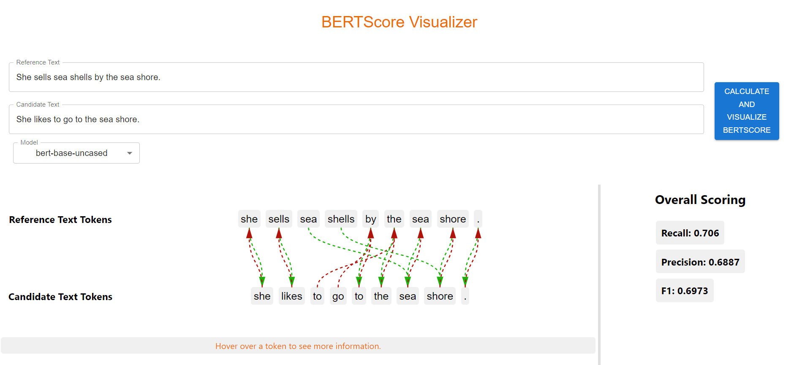

# BERTScoreVisualizer

BertScoreVisualizer is a React Web App that allows you to visualize how the BERTScore metric is scoring your generated text. It provides a visualization of the matching between tokens in the generated text to tokens in the reference text.

For more information on BERTScore, please refer to the original paper: [BERTScore: Evaluating Text Generation with BERT](https://arxiv.org/abs/1904.09675).

### Setup

Unfortunately, this React App is not currently deployed, so you must run it locally. However, this may change in the future!

BERTSoreVisualizer consists of a flask backend and a React frontend.

To initialize the backend, navigate to the `backend` folder and install all required dependencies with:

`pip install -r requirements.txt`

Then you can launch the backend with:

`flask run`

To get the frontend working, navigate to the `frontend` folder and run:

`npm install`

to install all the required frontend dependencies. Finally, to start the frontend, run:

`npm start`

### Acknowledgements

This project provides a visualization for the BERTScore Automatic Evaluation Metric. You can check out the original paper [here](https://arxiv.org/abs/1904.09675), as well as their [GitHub Repository](https://github.com/Tiiiger/bert_score?tab=readme-ov-file) for the official python package.
